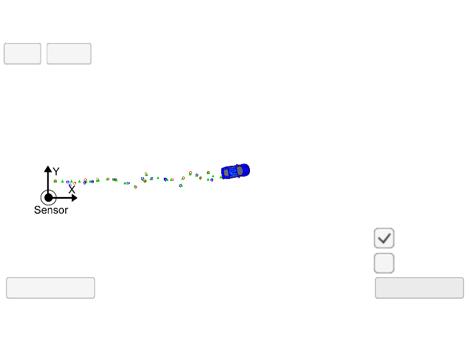
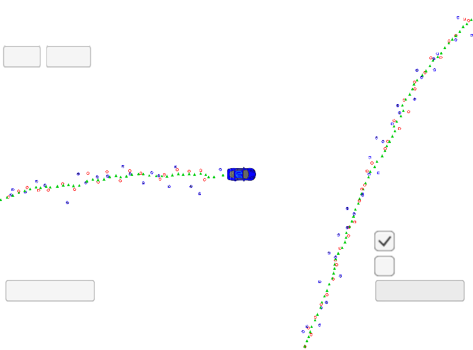

# Unscented Kalman Filter Project

This project was developed as part of the Udacity Self-Driving Car Engineer Nanodegree Program. The goal was to develop an Unscented Kalman Filter that used Radar and Lidar measurements to predict a car position with a Root-mean-square Error values under 0.09, 0.10, 0.40 and 0.30 for x, y, vx and vy, respectively.

## Overview

Kalman filters are algorithms that use noisy measurements to estimate the state of a moving object of interest by constantly predicting and updating it every time a new measurement is received. In this project two types of sensors were used (Lidar and Radar) to estimate a car position over time based on a constant turn rate and velocity magnitude(CTRV) motion model. To deal with the nonlinear process models and nonlinear measurement models we are going to use an Unscented Kalman Filter which takes representative points from a gaussian distribution to predict normally distributed states that approximate the real predicted distribution as close as possible.

## Environment Setup

Instructions for setting up the environment can be found [here](setup.md). After compiling, run the executable and open the simulator on the EKF & UKF project to check it out.

## Implementation

I started the development by getting the code I had already written for the quizzes of the Unscented Kalman Filter Lesson. I combined each piece of code to put together the Prediction and Radar Update steps. For the Laser Update I just copied the Update function from the kalman_filter.cpp file I implemented for the [Extended Kalman Filter Project](https://github.com/lealldiogo/CarND-Extended-Kalman-Filter-Project/) since it the laser measurement function is linear. Also used the ProcessMeasurement function from the FusionEKF.cpp to create the process of predictions and updates.

After making sure all the variables were consistent throughout the process and everything was linked, I was able to compile the project and run the simulation. But after a few steps, the simulation froze as shown in the picture below.



By printing the values I was getting for the state and covariance matrix before and after each step of the process (Prediction, UpdateLaser, UpdateRadar) I identified that the program was freezing in the Prediction step. Digging even deeper I discovered that the program was struggling to normalize high values of `yaw` angle.

I tried to normalize the angle in other parts of the code, avoid division by zero when transforming the radar measurements and also tuned a bit the `std_a_` and `std_yawdd_` but nothing seemed to work. Imagining that the matrices could have been initialized with residual values, I tried filling all of them with zeros after definition, but that didn't help much either and the simulation was still freezing after only a few steps.

It was only after sometime looking in the forums and debugging that I realized that the reason the values of the `yaw`, `yaw_rate` and also some values of the covariance matrix were exploding was the weights. The lambda value that I chose resulted in very small weights.

For that reason I changed lambda from `3 - n_aug_` to `6 - n_aug_` and managed to make the simulation run all the way to the end as shown in the picture below. The weights became big negative values which impacted the predicted mean state and covariance matrix and the values for `yaw` and `yaw_rate` stopped growing so much.



I was still not getting RMSE values sufficient to pass the rubric. To try to make them drop, I printed the ground truth values to initialize the state `x` with the first ground truth value. I initialized the covariance matrix as an identity matrix and played a bit with the `std_a_` and `std_yawdd` but that didn't seemed to affect the rmse values that much, so I decide to raise all the way up to `6.9 - n_aug_` keeping in mind that `n_aug_ = 7` and lambda couldn't be zero.

### Final RMSE values

After that tune, I was able to finish the simulation with the following values of RMSE:

```
RMSE X: 0.0744168
RMSE Y: 0.0858268
RMSE Vx: 0.205431
RMSE Vy: 0.287774
```

### Author

Diogo Loreto Leal, Self-Driving Car Engineer Nanodegree Student
